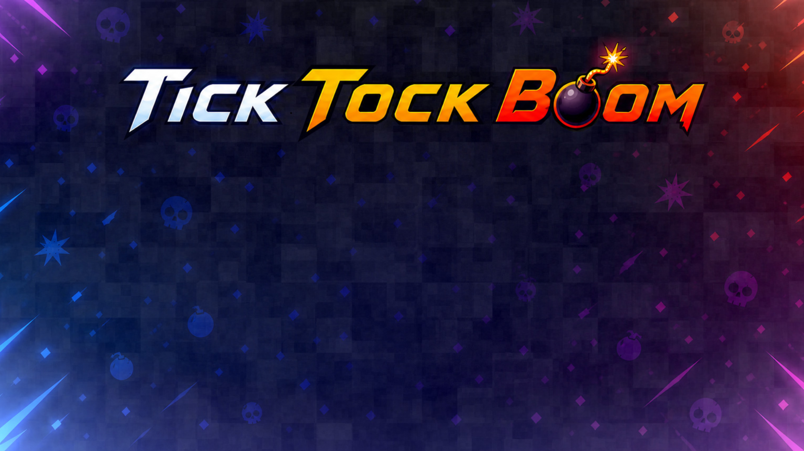
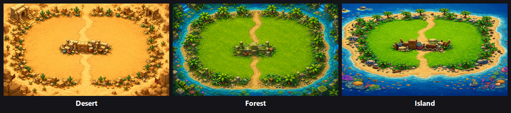
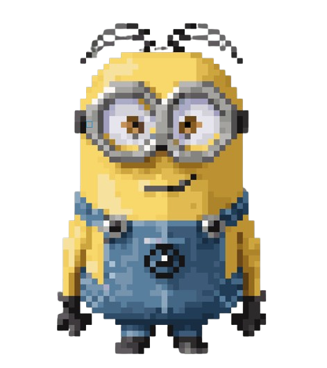

# Bomb to Boom

Ett 2D multiplayer-spel skrivet i C med SDL2, byggt som ett klient-server-projekt.



## 1. Spelöversikt

Spelet är ett 2D multiplayer-spel där fyra spelare tävlar mot varandra. Målet är att vara den sista överlevande spelaren.

## 2. Spelregler

- Spelet spelas med 4 spelare.
- Varje spelare har 3 liv.
- När spelet startar får en slumpmässig spelare en bomb.
- Spelaren med bomben måste försöka kasta den till en annan spelare.
- Övriga spelare försöker fly undan från spelaren med bomben.
- Bomben har en tidsgräns och exploderar efter en viss tid.
- Om bomben exploderar medan en spelare håller den, förlorar spelaren ett liv.

## 3. Spelmekanik

- Spelare kan röra sig fritt på kartan.
- Bomben kan kastas mellan spelare.
- När bomben kastas övergår den till den träffade spelaren.

## 4. Bana (Map)

- Spelet utspelar sig på en 2D-karta.
- Kartan innehåller slumpmässigt placerade items.
- Flera kartteman finns att välja mellan:



## 5. Power-ups (Items)

Under spelets gång kan spelare plocka upp olika förmågor:

- **SpeedRun** – ökar spelarens hastighet
- **Freeze** – fryser en annan spelare tillfälligt
- **Dance** – gör att en spelare rör sig långsammare
- Fler förmågor kan läggas till senare

## 6. Vinstvillkor

- En spelare förlorar när alla liv är slut.
- Spelet fortsätter tills endast en spelare är kvar.
- Den sista spelaren som överlever vinner spelet.

## Spelare



## Projektstruktur

```
KursProjekt/
├── Server/       # Serverkod (C)
├── client/       # Klientkod (C, SDL2)
├── shared/       # Delade headers mellan server och klient
└── makefile      # Bygger både server och klient
```

## Bygga och köra

**Beroenden:** GCC (MinGW) och SDL2 (SDL2, SDL2_image, SDL2_net, SDL2_ttf, SDL2_mixer).

Bygg allt (server + klient):

```
make
```

Kör servern och två klienter:

```
make run
```

Städa byggfiler:

```
make clean
```
